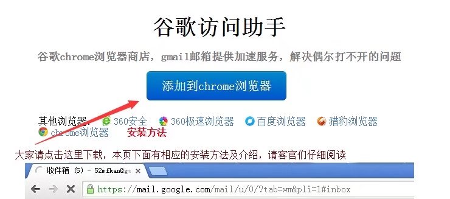
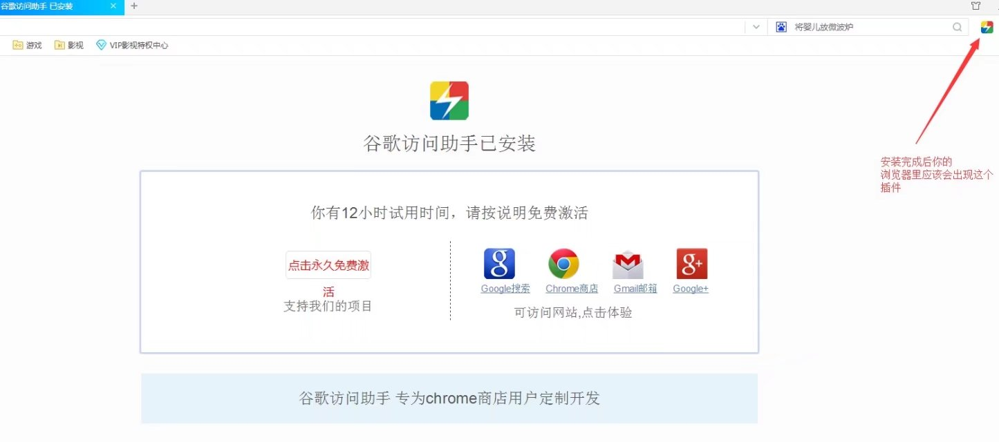
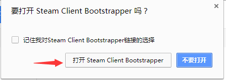

# ------------创建账号------------

## 创建账号：

账号注册有两种方法：1.官网邀请链接注册。2.Steam注册。

注：购买月卡需要有PayPal账号。

### 官网邀请注册：

官网的优点是可以使用邀请链接，在开局时候收到2.5M（百万）的技能点，在你第一次购买月卡后获得500 PLEX（飞行员执照），卖出后帮助你更快的开局，融入到00的生活中。

方法是加群后，私聊老崔（QQ：55830），把邮箱和名字给他，邀请链接会发到你邮箱中，在购买月卡后私聊他获得500 PLEX。

在被引导至EVE欧服官网后，设定自己的登录ID和登录密码，密码必须同时含有1个大写字母，1个小写字母和1个数字； 然后CCP会向你的邮箱再发送一封验证邮件，点击邮件中的链接来将邮箱与你的账号绑定。

#### 谷歌访问助手：

这里介绍一个通过谷歌访问助手链接的方法，并不是完全翻墙。下载地址是： [`www.ggfwzs.com`](http://www.ggfwzs.com/)。

登陆网页可以看到安装界面，下面的各个浏览器是可以点击的，点击后助手会安装到你选择的浏览器上。

### Steam注册：

Steam注册的优点是月卡更便宜，缺点就是没有官网的那些邀请奖励，开局比较困难，但是如果热情比较高，就没有问题了。

1. 首先，我们需要注册一个steam帐号，注意一定要中国区IP（可以是QQ邮箱）
2. 创建一个eve帐号
3. 在浏览器上输入：`steam://install/8500/`后回车安装

使用steam里面启动launcher，并且输入steam邮箱确认绑定

#### 解除steam登录绑定：

登录CCP [`http://secure.eveonline.com/AccountManMenu.aspx`](http://secure.eveonline.com/AccountManMenu.aspx) 人物改帐号地址  
（建议使用QQ浏览器，火狐 谷歌登录以免转圈圈）  
打开官网，登录，登录界面选择steam图标，用STEAM帐号登录进去，鼠标放上去显示 `EDIT ACCOUNT INFORMATION` 点击后跳转至填写用户资料，填写结束后点验证邮箱，进入邮箱打开链接设定EVE帐号密码。然后点击 `CHANGE PASSWORD` 就行CCP马甲绑定，修改完毕后就可以用新的CCP帐号密码登录CCP登录器

你再也不用担心STEAM登录有时无故消失帐号的麻烦，因为你已经属于CCP官方马甲的人了，官网登录器登陆即可。

