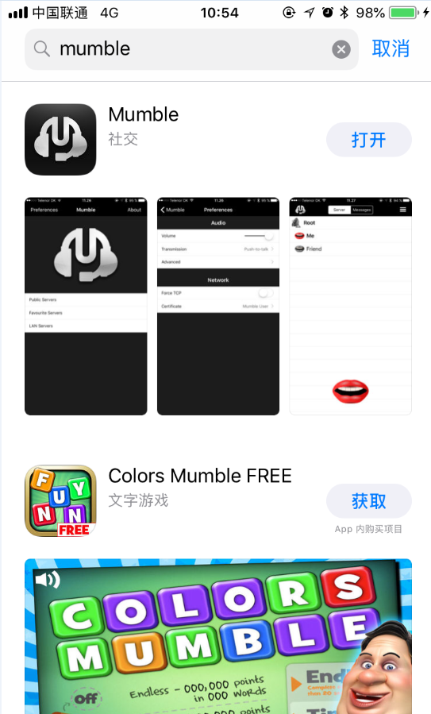
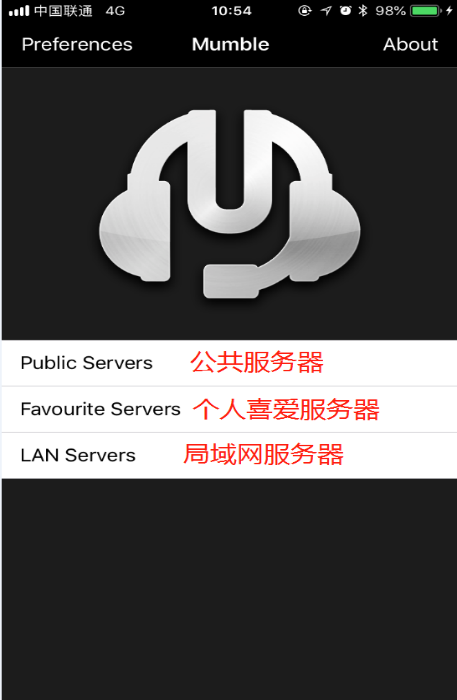
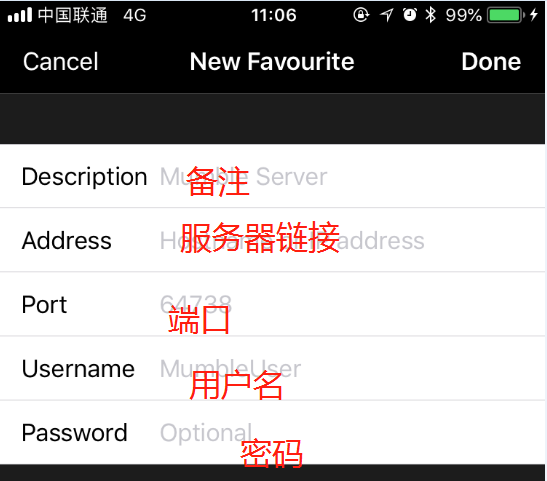

# -------Mumble手机版------

### 下载手机Mumble：

应用商店直接搜索Mumble

### 服务器选择：

打开手机Mumble后会有三个服务器选择： 公共服务器 个人喜爱服务器 局域网服务器 直接选择第二个进入服务器设置

### 服务器添加：

选择右上角添加按钮进入服务器添加  
第一行备注随意填写  
第二行填写联盟的服务器地址 `mumble.eve-info.net`  
第三行端口填写默认`64738`  
第四行填写你游戏中的用户名  
第五行填写你的设置的密码 密码设置地址 [`http://auth.eve-info.net`](http://auth.eve-info.net)

设置成功后点击新出现的链接就可以进入服务器愉快沟通

### 说话设置：

进入频道后默认是开启一直说话  
你可以点击左上角进行设置  
Self-mute-------关闭麦克风  
Self-Deafen-----关闭麦克风及耳机

