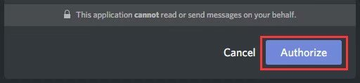

# ---------设置Discord---------

目前社区获取起队信息的唯一途径是DISCORD，它是一款可以在手机和电脑上安装的社交软件，你可以将它看作是一个国外的QQ。

下载DISCORD的渠道是：

PC：[`https://discordapp.com/api/download?platform=win`](https://discordapp.com/api/download?platform=win)

MAC：[`https://discordapp.com/api/download?platform=osx`](https://discordapp.com/api/download?platform=osx)

#### 安装：

下载完成后安装，然后为自己注册（Register）一个账号 接着下一步是获准进入社区在DISCORD上创建的频道，在开始这一步前你必须确保自己已经加入了社区旗下的任何一个联盟。 在确保游戏内角色已经加入联盟后，点击链接：[`https://discord.frt-eve.com`](https://discord.frt-eve.com) 然后在弹出的页面中登录你的DISCORD账号，账号是你注册时使用的邮箱地址（若你的PC已经登录了DISCORD则会自动跳过这一步） 接着点击弹出页面中的授权（Authorize）按钮：

然后你会被引导到CCP官网的登录页面，在这里登录你的EVE账号（必须登录那个已经加入联盟的账号） 最后一步是让你选择在DISCORD上发言所代用的身份，必须选用那个已经加入联盟的角色 在完成以上所有步骤后，页面最后只会显示一句话表示加入成功： `{"success":"You are now authenticated, close this window and use Discord like a champion!"}` 

在进入后DISCORD频道后找到一个叫做PING的子频道，修改设定以确保你能够收到这个频道的推送信息。

#### **注意：**

Discord的起队信息属于联盟机密，请不要发在外来人口较多的地方，如QQ群！

