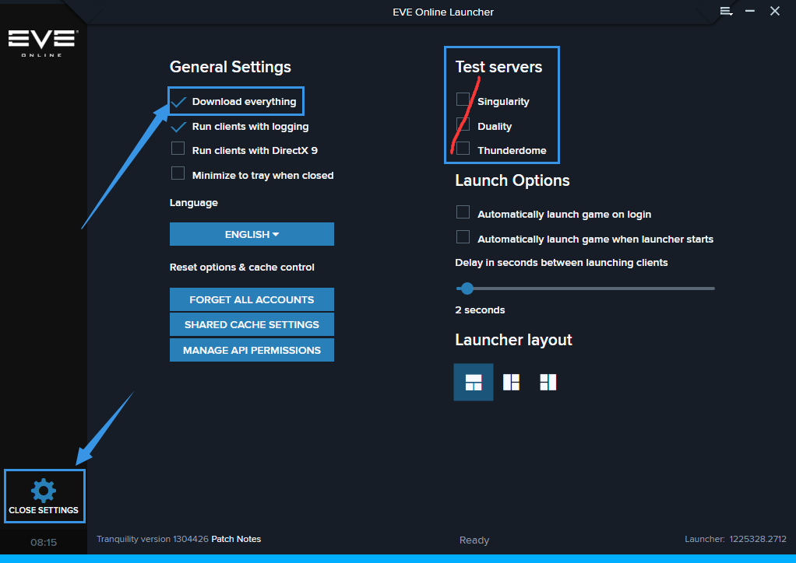

# ------------下载游戏------------

## 下载游戏：

因为EVE是可以变下变玩的，但是由于网速问题我们推荐下载完毕后再开始游戏。

海外党：直接打开[`eve欧服官网`](https://www.eveonline.com/download/)下载启动器

国内党：因为国内的网速限制，请先请在群里找到最新版本的启动器（也可点开上面的官网下载 EVELauncher），然后下载一个资源包（大约7GB），链接在这里，如果打不开可以试试直接把这个复制进下载器：[https://binaries.eveonline.com/EVEResources.7z](https://binaries.eveonline.com/EVEResources.7z)

下载完成后，把这个EVEResources放入你想要安装的地址，然后点开启动器EVELauncher 安装在同样的位置，这样他会自动解压资源包，省去大量的下载游戏内容时间。

安装启动器完成后打开，选择Download Everything，右侧的Test Servers是体验服，可以先取消勾选，完成后重启启动器，开始新一轮更新。 全部下载完毕后EVE文件夹应该是（16-23GB），启动器最底下的进度条应该如上图一样蓝色的显示Ready。

