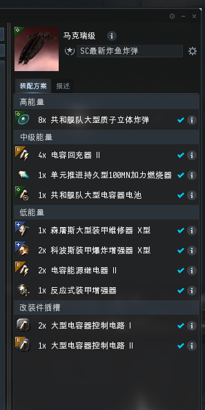
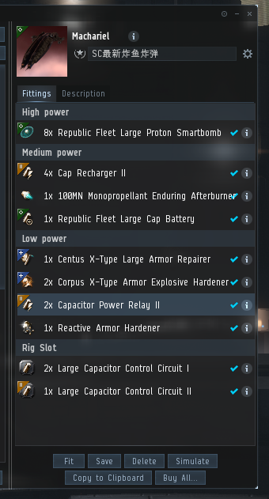
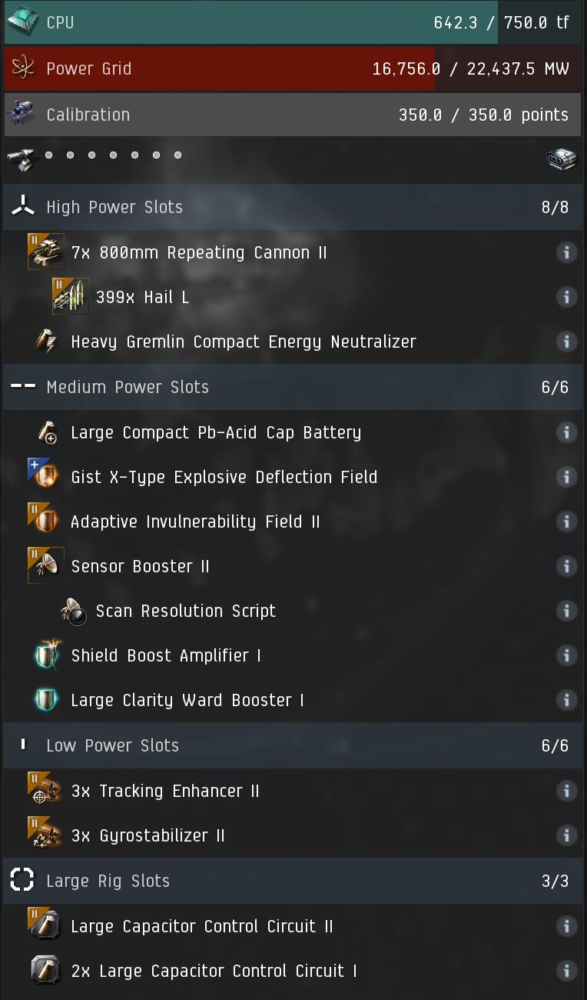
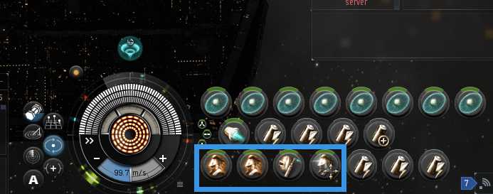
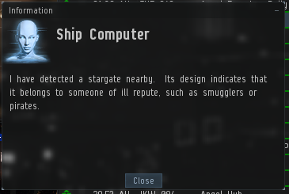
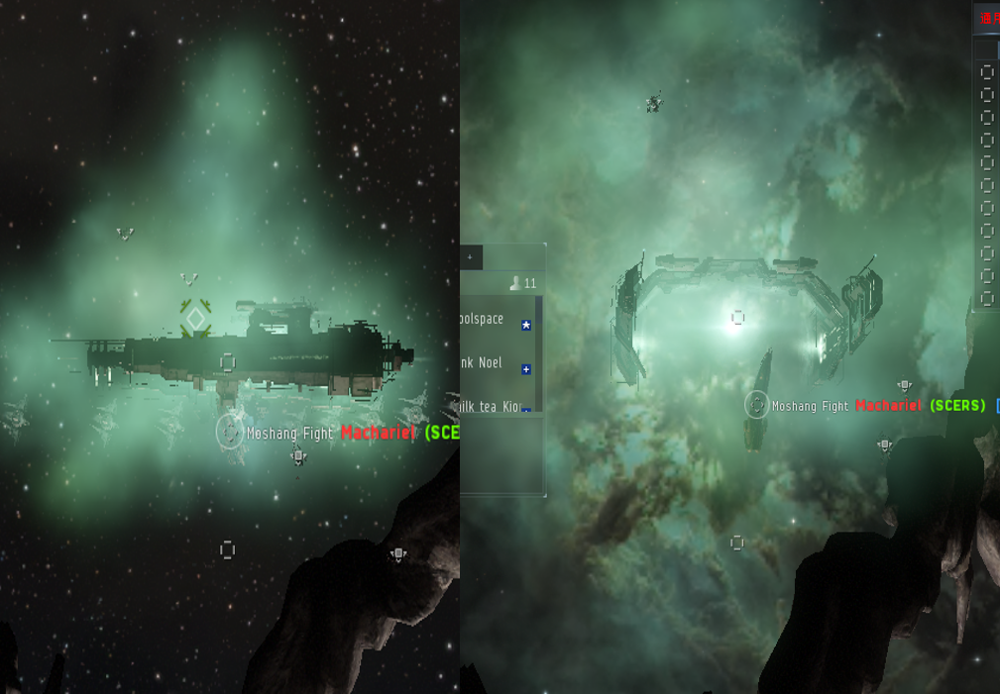

# -----------炸鱼教程-----------

## 炸鱼马配置：

以上为中文和英文版的炸弹马配置，在军团配置里面 在这个配置全能用的基础上，你需要满足以下要求： 在配置界面选择模拟（simulate），保证所有装备都在**上线**状态，你的CPU和能量栅格全部不能是负的。

接下来看电容，点击两次中槽的100加力，使它处于停用状态 ，接下来看模拟右上角 ，电容器这个选项，你需要让他显示稳定，如果你炸弹技能在4或者5，炸弹转一圈速度快，电容可能会无法稳定，这时候你只需要让电容保持在至少7分钟。 如果以上的CPU，能量栅格，电容你不满足要求，可以查看自己的工程（engineering）技能 以下技能截图仅供参考，如果CPU和能量栅格还不够，请上3%的CPU和能量栅格脑插，缺啥上啥插。

以上仅供参考，我是上了3%的CPU和电容插的，你还可以再上个2%或者3%的炸弹插，当然也可以不上

## 补刀马配置：

这个配置也在军团配置里面 你需要让自己能用T2的800炮和T2的弹药，名字是Hail L 军团配置里给大家配得是衍生的800炮，但我想说，不上T2没有足够的DPS你还补啥刀，开炸弹马去吧，炮辅技能你也需要挂到至少全4，你的DPS至少800以上，不然效率非常慢。 射击学技能就不贴了

## 开炸：

队长在开始炸鱼也就是中队带跳前会提前通知，你需要提前打开自己低槽的所有主动装备，**记住**，一定要开，不然你落地一会就船蛋双飞了

我们炸鱼炸的是星门避难，也就是俗称的小避难，他的特征是你在扫描器内点起跳后会出现弹窗

在炸鱼队落地之后，你需要立刻朝向异常内的两个可撞击建筑的最中间，打开你的100加力，看情况让它转两到三圈，使你的马克瑞快速运动到目标位置，在走位期间，你需要依次启用你高槽的八个炸弹，差不多你的第一个炸弹转完一圈，你的第八个炸弹刚好开始。**注意，千万要记得关推子，不然你会因为没电而无法开低槽而被队友炸死，滑稽。**

## 10/10：

我手头上没有10/10，就不说了，等你们出了就知道了。很多新人出了之后不知道咋找，其实就在代理人里面。

以上就是炸鱼的基本教程，祝大家炸的开心，钱包刷刷的鼓起来！

